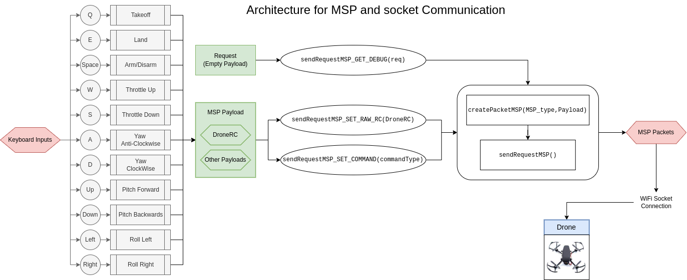

# Task 1 Submission
## Problem Statement for task 1

The first task required us to develop a python Wrapper for the Drone Pluto 1.2 using MSP packets and socket communication to control the basic movements of the drone (Arm, Take-off, Land, Throttle, Roll, Pitch, Yaw, etc). This was supposed to mirror the actions undertaken by the ROS package, but with direct python communication capable of being run on most machines without ROS or any supporting software. 
## Description
Our python wrapper is capable of running on both Windows and Linux machines and relies on simple python socket communication. We have provided a very basic teleop frontend for the drone, which can be used to simply fly the drone using keyboard keys. The same endpoints can also be used to make a controller frontend similar to the one in the Pluto mobile application. The teleop commands are the same ones used in the ROS teleop topic. 
In order to execute the wrapper, the following steps can be followed. 
- Clone the Repository
- Navigate to the Task 1 folder
- Connect to the drone's wifi
- Run the PlutoArm.py file. 
- Control the drone using the keyboard commands  
## Submission video
Please find the video at https://drive.google.com/file/d/1JOT3UtvXCk1xD3x8IDRCemADbwYyf3Qs/view?usp=sharing
## Teleop Commands
- Spacebar-arming/disarming
- W- Increase Throttle
- S- Decrease Throttle
- A- Yaw Counterclockwise
- D- Yaw Clockwise
- Arrow Left- Roll Left
- Arrow Right- Roll Right
- Arrow Up- Pitch forward
- Arrow Down- Pitch Backward

